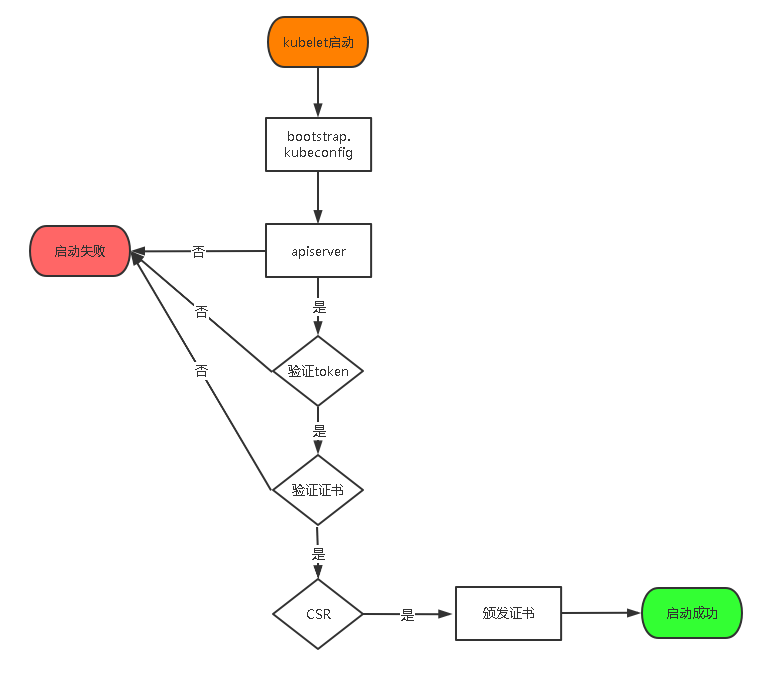

## 一、前置知识点

### 1.0 版本选择

K8s 更新的很快，现在时间是2020年6月29日，版本为v1.18、

### 1.1 部署规划

先部署为单master结构，再扩展为多master结构

顺便熟悉扩容流程


### 1.2 生产环境可部署Kubernetes集群的两种方式

目前生产部署Kubernetes集群主要有两种方式：

- **kubeadm**

Kubeadm是一个K8s部署工具，提供kubeadm init和kubeadm join，用于快速部署Kubernetes集群。

官方地址：https://kubernetes.io/docs/reference/setup-tools/kubeadm/kubeadm/

kubeadm是一个工具，使Kubernetes管理员能够快速，轻松地引导完全符合Certified Kubernetes指南的最小可行集群。 自2016年以来，SIG Cluster Lifecycle一直在积极开发，我们很高兴地宣布它已经从测试阶段逐步升级到稳定且普遍可用（GA）！

这个GA发布的kubeadm是Kubernetes生态系统发展过程中的重要事件，为稳定性至关重要的地区带来了稳定性。

kubeadm的目标是为Kubernetes集群设置和管理提供基础实现。kubeadm附带最佳实践默认值，但也可以自定义以支持其他生态系统要求或特定于供应商的方法。kubeadm旨在易于集成到更大的部署系统和工具中。


- **二进制包**

从github下载发行版的二进制包，手动部署每个组件，组成Kubernetes集群。

Kubeadm降低部署门槛，但屏蔽了很多细节，遇到问题很难排查。如果想更容易可控，推荐使用二进制包部署Kubernetes集群，虽然手动部署麻烦点，期间可以学习很多工作原理，也利于后期维护。


### 1.3 安装要求

在开始之前，部署Kubernetes集群机器需要满足以下几个条件：

- 操作系统 CentOS7.x-86_x64
- 硬件配置：2GB或更多RAM，2个CPU或更多CPU，硬盘30GB或更多
- 可以访问外网，需要拉取镜像，如果服务器不能上网，需要提前下载镜像并导入节点
- 禁止swap分区

### 1.4 准备环境

软件环境：

| **软件**   | **版本**      |
| ---------- | ------------- |
| 操作系统   | CentOS7.6_x64 |
| Docker     | 19-ce         |
| Kubernetes | 1.18          |

### 1.5 单master结构示意图


单master结构规划

| **角色**   |         **IP** | 主机名  |
| ---------- | -------------: | ------- |
| k8s-master | 192.168.168.12 | k02.com |
| k8s-node1  | 192.168.168.13 | K03.com |
| k8s-node2  | 192.168.168.14 | k04.com |
| K8s-node3  | 192.168.168.15 | K05.com |

之后扩容为双master结构，增加192.168.168.11


### 1.6 操作系统初始化配置

```shell
# 根据规划设置主机名
hostnamectl set-hostname <hostname>

# 关闭防火墙
systemctl stop firewalld
systemctl disable firewalld

# 关闭selinux
sed -i 's/enforcing/disabled/' /etc/selinux/config  # 永久
setenforce 0  # 临时

# 关闭swap
swapoff -a  # 临时
sed -ri 's/.*swap.*/#&/' /etc/fstab    # 永久


# 在master添加hosts
cat >> /etc/hosts << EOF
192.168.168.11 k01.com
192.168.168.12 k02.com
192.168.168.13 k03.com
192.168.168.14 k04.com
192.168.168.15 k05.com
EOF

# 将桥接的IPv4流量传递到iptables的链
cat > /etc/sysctl.d/k8s.conf << EOF
net.bridge.bridge-nf-call-ip6tables = 1
net.bridge.bridge-nf-call-iptables = 1
EOF
sysctl --system  # 生效

# 时间同步
yum install ntpdate -y
ntpdate time.windows.com
```

## 二、证书知识相关(不用操作，阅读章节)


### 集群证书相关

```shell
集群相关证书类型
client certificate： 用于服务端认证客户端,例如etcdctl、etcd proxy、fleetctl、docker客户端
server certificate: 服务端使用，客户端以此验证服务端身份,例如docker服务端、kube-apiserver
peer certificate: 双向证书，用于etcd集群成员间通信

根据认证对象可以将证书分成三类：服务器证书server cert，客户端证书client cert，对等证书peer cert(表示既是server cert又是client cert)，在kubernetes 集群中需要的证书种类如下：

etcd 节点需要标识自己服务的server cert，也需要client cert与etcd集群其他节点交互，当然可以分别指定2个证书，也可以使用一个对等证书

master 节点需要标识 apiserver服务的server cert，也需要client cert连接etcd集群，这里也使用一个对等证书

kubectl calico kube-proxy 只需要client cert，因此证书请求中 hosts 字段可以为空

kubelet证书比较特殊，不是手动生成，它由node节点TLS BootStrap向apiserver请求，由master节点的controller-manager 自动签发，包含一个client cert 和一个server cert


```

### CA机构

只要是合规可用的SSL证书都是由数字证书管理机构颁发的，这个机构就叫CA机构，CA机构是一个普遍受信的第三方组织，负责数字证书的申请及签发管理等工作，具有权威性的特征，当网站运营人员申请SSL证书时，是要向CA机构提供域名所有者和身份证明材料的，经过CA机构的人工审核并支付一定费用才可以颁发的。

**但是如果内网通信，我们可以自己创建一个CA机构，那么由其颁发的证书，内网可信即可**

#### CA证书

```

CA(Certification Authority)证书，指的是权威机构给我们颁发的证书。

密钥就是用来加解密用的文件或者字符串。密钥在非对称加密的领域里，指的是私钥和公钥，他们总是成对出现，其主要作用是加密和解密。常用的加密强度是2048bit。

RSA即非对称加密算法。非对称加密有两个不一样的密码，一个叫私钥，另一个叫公钥，用其中一个加密的数据只能用另一个密码解开，用自己的都解不了，也就是说用公钥加密的数据只能由私钥解开。

证书的编码格式
PEM(Privacy Enhanced Mail)，通常用于数字证书认证机构（Certificate Authorities，CA），扩展名为.pem, .crt, .cer, 和 .key。内容为Base64编码的ASCII码文件，有类似"-----BEGIN CERTIFICATE-----" 和 "-----END CERTIFICATE-----"的头尾标记。服务器认证证书，中级认证证书和私钥都可以储存为PEM格式（认证证书其实就是公钥）。Apache和nginx等类似的服务器使用PEM格式证书。

DER(Distinguished Encoding Rules)，与PEM不同之处在于其使用二进制而不是Base64编码的ASCII。扩展名为.der，但也经常使用.cer用作扩展名，所有类型的认证证书和私钥都可以存储为DER格式。Java使其典型使用平台。
```

#### 证书签名请求CSR

```
CSR(Certificate Signing Request)，它是向CA机构申请数字×××书时使用的请求文件。在生成请求文件前，我们需要准备一对对称密钥。私钥信息自己保存，请求中会附上公钥信息以及国家，城市，域名，Email等信息，CSR中还会附上签名信息。当我们准备好CSR文件后就可以提交给CA机构，等待他们给我们签名，签好名后我们会收到crt文件，即证书。

注意：CSR并不是证书。而是向权威证书颁发机构获得签名证书的申请。

把CSR交给权威证书颁发机构,权威证书颁发机构对此进行签名,完成。保留好CSR,当权威证书颁发机构颁发的证书过期的时候,你还可以用同样的CSR来申请新的证书,key保持不变.
```

#### 数字签名

数字签名就是"非对称加密+摘要算法"，其目的不是为了加密，而是用来防止他人篡改数据。

其核心思想是：比如A要给B发送数据，A先用摘要算法得到数据的指纹，然后用A的私钥加密指纹，加密后的指纹就是A的签名，B收到数据和A的签名后，也用同样的摘要算法计算指纹，然后用A公开的公钥解密签名，比较两个指纹，如果相同，说明数据没有被篡改，确实是A发过来的数据。假设C想改A发给B的数据来欺骗B，因为篡改数据后指纹会变，要想跟A的签名里面的指纹一致，就得改签名，但由于没有A的私钥，所以改不了，如果C用自己的私钥生成一个新的签名，B收到数据后用A的公钥根本就解不开。

常用的摘要算法有MD5、SHA1、SHA256。

使用私钥对需要传输的文本的摘要进行加密，得到的密文即被称为该次传输过程的签名。


#### 数字证书和公钥

数字证书则是由证书认证机构（CA）对证书申请者真实身份验证之后，用CA的根证书对申请人的一些基本信息以及申请人的公钥进行签名（相当于加盖发证书机 构的公章）后形成的一个数字文件。实际上，**数字证书就是经过CA认证过的公钥**，除了公钥，还有其他的信息，比如Email，国家，城市，域名等。

**数字证书就是经过CA认证过的公钥**

**数字证书就是经过CA认证过的公钥**


#### cfssl 相关

项目地址： https://github.com/cloudflare/cfssl

下载地址： https://pkg.cfssl.org/

参考链接： https://blog.cloudflare.com/how-to-build-your-own-public-key-infrastructure/

CFSSL是CloudFlare开源的一款PKI/TLS工具。 CFSSL 包含一个命令行工具 和一个用于 签名，验证并且捆绑TLS证书的 HTTP API 服务。 使用Go语言编写。

CFSSL包括：

- 一组用于生成自定义 TLS PKI 的工具
- `cfssl`程序，是CFSSL的命令行工具
- `multirootca`程序是可以使用多个签名密钥的证书颁发机构服务器
- `mkbundle`程序用于构建证书池
- `cfssljson`程序，从`cfssl`和`multirootca`程序获取JSON输出，并将证书，密钥，CSR和bundle写入磁盘

PKI借助数字证书和公钥加密技术提供可信任的网络身份。通常，证书就是一个包含如下身份信息的文件：

- 证书所有组织的信息
- 公钥
- 证书颁发组织的信息
- 证书颁发组织授予的权限，如证书有效期、适用的主机名、用途等
- 使用证书颁发组织私钥创建的数字签名


通常，**证书就是一个包含如下身份信息的文件**

- 证书所有组织的信息
- 公钥
- 证书颁发组织的信息
- 证书颁发组织授予的权限，如证书有效期、适用的主机名、用途等
- 使用证书颁发组织私钥创建的数字签名

### 安装cfssl

cfssl用法参考：https://coreos.com/os/docs/latest/generate-self-signed-certificates.html

这里我们只用到`cfssl`工具和`cfssljson`工具：

```
wget https://pkg.cfssl.org/R1.2/cfssl_linux-amd64
wget https://pkg.cfssl.org/R1.2/cfssljson_linux-amd64
wget https://pkg.cfssl.org/R1.2/cfssl-certinfo_linux-amd64
chmod +x cfssl_linux-amd64 cfssljson_linux-amd64 cfssl-certinfo_linux-amd64
mv cfssl_linux-amd64 /usr/local/bin/cfssl
mv cfssljson_linux-amd64 /usr/local/bin/cfssljson
mv cfssl-certinfo_linux-amd64 /usr/bin/cfssl-certinfo
```

`cfssl`工具，子命令介绍：

- `bundle`: 创建包含客户端证书的证书包

- **`genkey`: 生成一个key(私钥)和CSR(证书签名请求)**

- `scan`: 扫描主机问题

- **`revoke`: 吊销证书**

- **`certinfo`: 输出给定证书的证书信息， 跟cfssl-certinfo 工具作用一样**

- `gencrl`: 生成新的证书吊销列表

- `selfsign`: 生成一个新的自签名密钥和 签名证书

- `print-defaults`: 打印默认配置，这个默认配置可以用作模板

   config：生成ca配置模板文件

   csr：生成证书请求模板文件 

- **`serve`: 启动一个HTTP API服务**

- **`gencert`: 生成新的key(密钥)和签名证书**

  - **-initca：初始化一个新ca**
  - **-ca：指明ca的证书**
  - **-ca-key：指明ca的私钥文件**
  - **-config：指明请求证书的json文件**
  - **-profile：与-config中的profile对应，是指根据config中的profile段来生成证书的相关信息**

- `ocspdump`

- `ocspsign`

- `info`: 获取有关远程签名者的信息

- `sign`: 签名一个客户端证书，通过给定的CA和CA密钥，和主机名

- `ocsprefresh`

- `ocspserve`


### 创建CA证书

也就是我们自己创建一个内网可信的CA机构用来颁发证书

CFSSL可以创建一个获取和操作证书的内部认证中心。

**运行认证中心需要一个CA证书和相应的CA私钥**。任何知道私钥的人都可以充当CA颁发证书。因此，私钥的保护至关重要。

#### 配置证书生成策略

配置证书生成策略，让CA软件知道颁发有什么功能的证书

```shell
#打印config模板文件从而进行修改
#cfssl print-defaults config > ca-config.json

#对模板进行修改，从而变成适合自己的
#vim ca-config.json
{
  "signing": {
    "default": {
      "expiry": "8760h"
    },
    "profiles": {
      "kubernetes": {
        "usages": [
            "signing",
            "key encipherment",
            "server auth",
            "client auth"
        ],
        "expiry": "8760h"
      }
    }
  }
}
```

这个策略，有一个default默认的配置，和一个`profiles`，profiles可以设置多个`profile`

- default默认策略，指定了证书的默认有效期是一年(8760h)
- kubernetes：表示该配置(profile)的用途是为kubernetes生成证书及相关的校验工作
  - signing：表示该证书可用于签名其它证书；生成的 ca.pem 证书中 CA=TRUE
  - server auth：表示可以该CA 对 server 提供的证书进行验证
  - client auth：表示可以用该 CA 对 client 提供的证书进行验证
- expiry：也表示过期时间，如果不写以default中的为准


cfssl常用命令：

- `cfssl gencert -initca ca-csr.json | cfssljson -bare ca ## 初始化ca`
- `cfssl gencert -initca -ca-key key.pem ca-csr.json | cfssljson -bare ca ## 使用现有私钥, 重新生成`
- `cfssl certinfo -cert ca.pem`
- `cfssl certinfo -csr ca.csr`

#### 生成CA证书和私钥(根证书和私钥)

首先这是一个自签证书

创建一个文件`ca-csr.json`：

```
#打印csr模板文件从而进行修改
#cfssl print-defaults csr > ca-csr.json

#vim ca-csr.json
{
  "CN": "kubernetes",
  "key": {
    "algo": "rsa",
    "size": 2048
  },
  "names": [
    {
      "C": "CN",
      "ST": "ShangHai",
      "L": "ShangHai",
      "O": "k8s",
      "OU": "System"
    }
  ]
}
```

参数介绍:

- **CN: Common Name，浏览器使用该字段验证网站是否合法，一般写的是域名。非常重要。浏览器使用该字段验证网站是否合法**
- key：生成证书的算法
- hosts：表示哪些主机名(域名)或者IP可以使用此csr申请的证书，为空或者""表示所有的都可以使用(本例中没有hosts字段)
- names：一些其它的属性
  - C: Country， 国家
  - ST: State，州或者是省份
  - L: Locality Name，地区，城市
  - O: Organization Name，组织名称，公司名称(在k8s中常用于指定Group，进行RBAC绑定)
  - OU: Organization Unit Name，组织单位名称，公司部门

生成CA证书和CA私钥和CSR(证书签名请求):

```bash
[root@ks-allinone ssl]# cfssl gencert -initca csr.json | cfssljson -bare ca
2019/08/21 21:10:32 [INFO] generating a new CA key and certificate from CSR
2019/08/21 21:10:32 [INFO] generate received request
2019/08/21 21:10:32 [INFO] received CSR
2019/08/21 21:10:32 [INFO] generating key: ecdsa-256
2019/08/21 21:10:32 [INFO] encoded CSR
2019/08/21 21:10:32 [INFO] signed certificate with serial number 672899525398989895780710333033770062104419034384
[root@ks-allinone ssl]# ll
total 20
-rw-r--r--. 1 root root 505 Aug 21 21:10 ca.csr
-rw-------. 1 root root 227 Aug 21 21:10 ca-key.pem
-rw-r--r--. 1 root root 745 Aug 21 21:10 ca.pem
-rw-r--r--. 1 root root 373 Aug 21 14:21 config.json
-rw-r--r--. 1 root root 287 Aug 21 14:11 csr.json
```

**该命令会生成运行CA所必需的文件`ca-key.pem`（私钥）和`ca.pem`（证书），还会生成`ca.csr`（证书签名请求），用于交叉签名或重新签名。也叫做根证书**


查看cert(证书信息):

```bash
# cfssl certinfo -cert ca.pem
```

查看CSR(证书签名请求)信息：

```bash
# cfssl certinfo -csr ca.csr
```


## 三、部署Etcd集群

Etcd 是一个分布式键值存储系统，Kubernetes使用Etcd进行数据存储，所以先准备一个Etcd数据库，为解决Etcd单点故障，应采用集群方式部署，这里使用3台组建集群，可容忍1台机器故障，当然，你也可以使用5台组建集群，可容忍2台机器故障


| **角色** |         **IP** | 主机名  |
| -------- | -------------: | ------- |
| Etcd01   | 192.168.168.13 | K03.com |
| Etcd02   | 192.168.168.14 | k04.com |
| Etcd03   | 192.168.168.15 | K05.com |


### 2.1 准备cfssl证书生成工具（k02-05都做）

cfssl是一个开源的证书管理工具，使用json文件生成证书，相比openssl更方便使用。

CFSSL是CloudFlare开源的一款PKI/TLS工具。 CFSSL 包含一个命令行工具 和一个用于 签名，验证并且捆绑TLS证书的 HTTP API 服务。 使用Go语言编写。

Github 地址： https://github.com/cloudflare/cfssl

找任意一台服务器操作，这里用Master节点。

```shell
cd /tmp  && wget https://pkg.cfssl.org/R1.2/cfssl_linux-amd64 && wget https://pkg.cfssl.org/R1.2/cfssljson_linux-amd64 && wget https://pkg.cfssl.org/R1.2/cfssl-certinfo_linux-amd64
chmod +x cfssl_linux-amd64 cfssljson_linux-amd64 cfssl-certinfo_linux-amd64
mv cfssl_linux-amd64 /usr/local/bin/cfssl
mv cfssljson_linux-amd64 /usr/local/bin/cfssljson
mv cfssl-certinfo_linux-amd64 /usr/bin/cfssl-certinfo

mkdir -p ~/TLS/{etcd,k8s}
```

### 2.2 生成Etcd证书（k03做）

#### 1. 自签证书颁发机构（CA）

创建工作目录：

```shell
mkdir -p ~/TLS/{etcd,k8s}

cd TLS/etcd
```

自签CA：

```shell
cat > ca-config.json << EOF
{
  "signing": {
    "default": {
      "expiry": "87600h"
    },
    "profiles": {
      "www": {
         "expiry": "87600h",
         "usages": [
            "signing",
            "key encipherment",
            "server auth",
            "client auth"
        ]
      }
    }
  }
}
EOF

cat > ca-csr.json << EOF
{
    "CN": "etcd CA",
    "key": {
        "algo": "rsa",
        "size": 2048
    },
    "names": [
        {
            "C": "CN",
            "L": "Beijing",
            "ST": "Beijing"
        }
    ]
}
EOF
```

生成自签根证书：

```shell
cfssl gencert -initca ca-csr.json | cfssljson -bare ca -

[root@k03 etcd]# ll
总用量 20
-rw-r--r-- 1 root root  287 6月  29 18:27 ca-config.json
-rw-r--r-- 1 root root  956 6月  29 18:31 ca.csr
-rw-r--r-- 1 root root  209 6月  29 18:27 ca-csr.json
-rw------- 1 root root 1675 6月  29 18:31 ca-key.pem
-rw-r--r-- 1 root root 1265 6月  29 18:31 ca.pem

该命令会生成运行CA所必需的文件ca-key.pem（私钥）和 ca.pem（证书），还会生成ca.csr（证书签名请求），用于交叉签名或重新签名。ca.pem也叫做根证书
```

#### 2. 使用自签CA证书(也叫根证书)签发Etcd HTTPS证书

创建证书申请文件

```
cat > server-csr.json << EOF
{
    "CN": "etcd",
    "hosts": [
    "192.168.168.13",
    "192.168.168.14",
    "192.168.168.15"
    ],
    "key": {
        "algo": "rsa",
        "size": 2048
    },
    "names": [
        {
            "C": "CN",
            "L": "BeiJing",
            "ST": "BeiJing"
        }
    ]
}
EOF

注：上述文件hosts字段中IP为所有etcd节点的集群内部通信IP，一个都不能少！为了方便后期扩容可以多写几个预留的IP。
```

生成证书：

```shell
cfssl gencert -ca=ca.pem -ca-key=ca-key.pem -config=ca-config.json -profile=www server-csr.json | cfssljson -bare server

ls server*pem
server-key.pem  server.pem
```

### 2.3 从Github下载二进制文件

`cd /tmp && wget https://github.com/etcd-io/etcd/releases/download/v3.4.9/etcd-v3.4.9-linux-amd64.tar.gz`

### 2.4 部署Etcd集群

**以下在节点1上操作，为简化操作，待会将节点1生成的所有文件拷贝到节点2和节点3.**

#### 1. 创建工作目录并解压二进制包

```shell
mkdir /opt/etcd/{bin,cfg,ssl} -p
tar zxvf etcd-v3.4.9-linux-amd64.tar.gz
mv etcd-v3.4.9-linux-amd64/{etcd,etcdctl} /opt/etcd/bin/
```

#### 2. 创建etcd配置文件

```shell
cat > /opt/etcd/cfg/etcd.conf << EOF
#[Member]
ETCD_NAME="k03.com"
ETCD_DATA_DIR="/var/lib/etcd/default.etcd"
ETCD_LISTEN_PEER_URLS="https://192.168.168.13:2380"
ETCD_LISTEN_CLIENT_URLS="https://192.168.168.13:2379"
#[Clustering]
ETCD_INITIAL_ADVERTISE_PEER_URLS="https://192.168.168.13:2380"
ETCD_ADVERTISE_CLIENT_URLS="https://192.168.168.13:2379"
ETCD_INITIAL_CLUSTER="k03.com=https://192.168.168.13:2380,k04.com=https://192.168.168.14:2380,k05.com=https://192.168.168.15:2380"
ETCD_INITIAL_CLUSTER_TOKEN="etcd-cluster"
ETCD_INITIAL_CLUSTER_STATE="new"
EOF
```

- ETCD_NAME：节点名称，集群中唯一
- ETCD_DATA_DIR：数据目录
- ETCD_LISTEN_PEER_URLS：集群通信监听地址
- ETCD_LISTEN_CLIENT_URLS：客户端访问监听地址
- ETCD_INITIAL_ADVERTISE_PEER_URLS：集群通告地址
- ETCD_ADVERTISE_CLIENT_URLS：客户端通告地址
- ETCD_INITIAL_CLUSTER：集群节点地址
- ETCD_INITIAL_CLUSTER_TOKEN：集群Token
- ETCD_INITIAL_CLUSTER_STATE：加入集群的当前状态，new是新集群，existing表示加入已有集群

#### 3. systemd管理etcd

```
cat > /usr/lib/systemd/system/etcd.service << EOF
[Unit]
Description=Etcd Server
After=network.target
After=network-online.target
Wants=network-online.target

[Service]
Type=notify
EnvironmentFile=/opt/etcd/cfg/etcd.conf
ExecStart=/opt/etcd/bin/etcd \
--cert-file=/opt/etcd/ssl/server.pem \
--key-file=/opt/etcd/ssl/server-key.pem \
--peer-cert-file=/opt/etcd/ssl/server.pem \
--peer-key-file=/opt/etcd/ssl/server-key.pem \
--trusted-ca-file=/opt/etcd/ssl/ca.pem \
--peer-trusted-ca-file=/opt/etcd/ssl/ca.pem \
--logger=zap
Restart=on-failure
LimitNOFILE=65536

[Install]
WantedBy=multi-user.target
EOF
```

#### 4. 拷贝刚才生成的证书

把刚才生成的证书拷贝到配置文件中的路径：

```shell
cp ~/TLS/etcd/ca*pem ~/TLS/etcd/server*pem /opt/etcd/ssl/
```

#### 5. 启动并设置开机启动

```shell
systemctl daemon-reload
systemctl start etcd
systemctl enable etcd
```

#### 6. 将k03.com所有生成的文件拷贝到k04.com和k05.com

```shell
scp -r /opt/etcd/ root@k04.com:/opt/
scp /usr/lib/systemd/system/etcd.service root@k04.com:/usr/lib/systemd/system/
scp -r /opt/etcd/ root@k04.com:/opt/
scp /usr/lib/systemd/system/etcd.service root@k04.com:/usr/lib/systemd/system/
```

然后在 k04.com 和 k05.com 分别修改etcd.conf 配置文件中的节点名称和当前服务器IP

vim /opt/etcd/cfg/etcd.conf

**将对应的ETCD_NAME 与IP地址修改好**

然后在k04.com 与 k05.com 上执行

`systemctl daemon-reload && systemctl start etcd && systemctl enable etcd`

#### 7. 集群状态

```powershell
ETCDCTL_API=3 /opt/etcd/bin/etcdctl --cacert=/opt/etcd/ssl/ca.pem --cert=/opt/etcd/ssl/server.pem --key=/opt/etcd/ssl/server-key.pem --endpoints="https://192.168.168.13:2379,https://192.168.168.14:2379,https://192.168.168.15:2379" endpoint health                   
https://192.168.168.15:2379 is healthy: successfully committed proposal: took = 24.261941ms
https://192.168.168.14:2379 is healthy: successfully committed proposal: took = 25.45841ms
https://192.168.168.13:2379 is healthy: successfully committed proposal: took = 32.42425ms
```

如果输出上面信息，就说明集群部署成功。如果有问题第一步先看日志：/var/log/message 或 journalctl -u etcd

## 四、安装docker

下载地址：https://download.docker.com/linux/static/stable/x86_64/docker-19.03.9.tgz

以下在**所有**节点操作。这里采用二进制安装，用yum安装也一样。

```
tar zxvf docker-19.03.9.tgz
mv docker/* /usr/bin
```

```
cat > /usr/lib/systemd/system/docker.service << EOF
[Unit]
Description=Docker Application Container Engine
Documentation=https://docs.docker.com
After=network-online.target firewalld.service
Wants=network-online.target

[Service]
Type=notify
ExecStart=/usr/bin/dockerd
ExecReload=/bin/kill -s HUP $MAINPID
LimitNOFILE=infinity
LimitNPROC=infinity
LimitCORE=infinity
TimeoutStartSec=0
Delegate=yes
KillMode=process
Restart=on-failure
StartLimitBurst=3
StartLimitInterval=60s

[Install]
WantedBy=multi-user.target
EOF
```

```
mkdir /etc/docker
cat > /etc/docker/daemon.json << EOF
{
  "registry-mirrors": ["https://b9pmyelo.mirror.aliyuncs.com"]
}
EOF
```

registry-mirrors 阿里云镜像加速器

```
systemctl daemon-reload
systemctl start docker
systemctl enable docker
```


## 五、部署master node

### 5.1 生成kube-apiserver证书

#### 1. 生成自签证书或者也可以叫做根证书

```powershell
cd ~/TLS/k8s
cat > ca-config.json << EOF
{
  "signing": {
    "default": {
      "expiry": "87600h"
    },
    "profiles": {
      "kubernetes": {
         "expiry": "87600h",
         "usages": [
            "signing",
            "key encipherment",
            "server auth",
            "client auth"
        ]
      }
    }
  }
}
EOF
cat > ca-csr.json << EOF
{
    "CN": "kubernetes",
    "key": {
        "algo": "rsa",
        "size": 2048
    },
    "names": [
        {
            "C": "CN",
            "L": "Beijing",
            "ST": "Beijing",
            "O": "k8s",
            "OU": "System"
        }
    ]
}
EOF


cfssl gencert -initca ca-csr.json | cfssljson -bare ca -

**观察结果输出，可以看到干了什么**
2020/06/29 20:52:27 [INFO] generating a new CA key and certificate from CSR
2020/06/29 20:52:27 [INFO] generate received request
2020/06/29 20:52:27 [INFO] received CSR
2020/06/29 20:52:27 [INFO] generating key: rsa-2048
2020/06/29 20:52:27 [INFO] encoded CSR
2020/06/29 20:52:27 [INFO] signed certificate with serial number 578455823241287535722342086037725054359114019047


[root@k02 k8s]# ll
总用量 20
-rw-r--r-- 1 root root  294 6月  29 20:48 ca-config.json
-rw-r--r-- 1 root root 1001 6月  29 20:52 ca.csr
-rw-r--r-- 1 root root  264 6月  29 20:49 ca-csr.json
-rw------- 1 root root 1675 6月  29 20:52 ca-key.pem
-rw-r--r-- 1 root root 1359 6月  29 20:52 ca.pem
```


#### 2.使用自签CA签发kube-apiserver HTTPS证书

```powershell
cd TLS/k8s
cat > server-csr.json << EOF
{
    "CN": "kubernetes",
    "hosts": [
      "10.0.0.1",
      "127.0.0.1",
      "192.168.168.11",
      "192.168.168.12",
      "192.168.168.13",
      "192.168.168.14",
      "192.168.168.15",
      "192.168.168.16",
      "192.168.168.17",
      "192.168.168.18",
      "kubernetes",
      "kubernetes.default",
      "kubernetes.default.svc",
      "kubernetes.default.svc.cluster",
      "kubernetes.default.svc.cluster.local"
    ],
    "key": {
        "algo": "rsa",
        "size": 2048
    },
    "names": [
        {
            "C": "CN",
            "L": "BeiJing",
            "ST": "BeiJing",
            "O": "k8s",
            "OU": "System"
        }
    ]
}
EOF
注：上述文件hosts字段中IP为所有Master/LB/VIP IP，一个都不能少！为了方便后期扩容可以多写几个预留的IP。


生成证书：
cfssl gencert -ca=ca.pem -ca-key=ca-key.pem -config=ca-config.json -profile=kubernetes server-csr.json | cfssljson -bare server

[root@k02 k8s]# ll
总用量 36
-rw-r--r-- 1 root root  294 6月  29 20:48 ca-config.json
-rw-r--r-- 1 root root 1001 6月  29 20:52 ca.csr
-rw-r--r-- 1 root root  264 6月  29 20:49 ca-csr.json
-rw------- 1 root root 1675 6月  29 20:52 ca-key.pem
-rw-r--r-- 1 root root 1359 6月  29 20:52 ca.pem
-rw-r--r-- 1 root root 1301 6月  29 20:57 server.csr
-rw-r--r-- 1 root root  680 6月  29 20:57 server-csr.json
-rw------- 1 root root 1675 6月  29 20:57 server-key.pem
-rw-r--r-- 1 root root 1667 6月  29 20:57 server.pem

生成了server-key.pem 与 server.pem

```

### 5.2 从Github下载二进制文件

下载地址： https://github.com/kubernetes/kubernetes/blob/master/CHANGELOG/CHANGELOG-1.18.md#v1183

注：打开链接你会发现里面有很多包，下载一个server包就够了，包含了Master和Worker Node二进制文件。

```
wget https://dl.k8s.io/v1.18.3/kubernetes-server-linux-amd64.tar.gz
```


### 5.3 解压二进制包

```shell
mkdir -p /opt/kubernetes/{bin,cfg,ssl,logs} 
tar zxvf kubernetes-server-linux-amd64.tar.gz
cd kubernetes/server/bin
cp kube-apiserver kube-scheduler kube-controller-manager /opt/kubernetes/bin
cp kubectl /usr/bin/
```

### 5.4 部署kube-apiserver

#### 1. 创建配置文件

```
cat > /opt/kubernetes/cfg/kube-apiserver.conf << EOF
KUBE_APISERVER_OPTS="--logtostderr=false \\
--v=2 \\
--log-dir=/opt/kubernetes/logs \\
--etcd-servers=https://192.168.168.13:2379,https://192.168.168.14:2379,https://192.168.168.15:2379 \\
--bind-address=192.168.168.12 \\
--secure-port=6443 \\
--advertise-address=192.168.168.12 \\
--allow-privileged=true \\
--service-cluster-ip-range=10.0.0.0/24 \\
--enable-admission-plugins=NamespaceLifecycle,LimitRanger,ServiceAccount,ResourceQuota,NodeRestriction \\
--authorization-mode=RBAC,Node \\
--enable-bootstrap-token-auth=true \\
--token-auth-file=/opt/kubernetes/cfg/token.csv \\
--service-node-port-range=30000-32767 \\
--kubelet-client-certificate=/opt/kubernetes/ssl/server.pem \\
--kubelet-client-key=/opt/kubernetes/ssl/server-key.pem \\
--tls-cert-file=/opt/kubernetes/ssl/server.pem  \\
--tls-private-key-file=/opt/kubernetes/ssl/server-key.pem \\
--client-ca-file=/opt/kubernetes/ssl/ca.pem \\
--service-account-key-file=/opt/kubernetes/ssl/ca-key.pem \\
--etcd-cafile=/opt/etcd/ssl/ca.pem \\
--etcd-certfile=/opt/etcd/ssl/server.pem \\
--etcd-keyfile=/opt/etcd/ssl/server-key.pem \\
--audit-log-maxage=30 \\
--audit-log-maxbackup=3 \\
--audit-log-maxsize=100 \\
--audit-log-path=/opt/kubernetes/logs/k8s-audit.log"
EOF
```

注：上面两个\ \ 第一个是转义符，第二个是换行符，使用转义符是为了使用EOF保留换行符。

```
--logtostderr：启用日志
---v：日志等级
--log-dir：日志目录
--etcd-servers：etcd集群地址
--bind-address：监听地址
--secure-port：https安全端口
--advertise-address：集群通告地址
--allow-privileged：启用授权
--service-cluster-ip-range：Service虚拟IP地址段
--enable-admission-plugins：准入控制模块
--authorization-mode：认证授权，启用RBAC授权和节点自管理
--enable-bootstrap-token-auth：启用TLS bootstrap机制
--token-auth-file：bootstrap token文件
--service-node-port-range：Service nodeport类型默认分配端口范围
--kubelet-client-xxx：apiserver访问kubelet客户端证书
--tls-xxx-file：apiserver https证书
--etcd-xxxfile：连接Etcd集群证书
--audit-log-xxx：审计日志
```

#### 2. 拷贝刚才生成的证书

把刚才生成的证书拷贝到配置文件中的路径：

```powershell
cp ~/TLS/k8s/ca*pem ~/TLS/k8s/server*pem /opt/kubernetes/ssl/
```


#### 3.拷贝etcd证书到当前节点

因为apiserver 与 etcd 交互，也需要证书，所以master也要有etcd证书和etcd相关的文件夹

```
mkdir -p /opt/etcd/ssl

scp k03.com:/opt/etcd/ssl/*   /opt/etcd/ssl/
```


#### 3. 启用 TLS Bootstrapping 机制

TLS Bootstraping：Master apiserver启用TLS认证后，Node节点kubelet和kube-proxy要与kube-apiserver进行通信，必须使用CA签发的有效证书才可以，当Node节点很多时，这种客户端证书颁发需要大量工作，同样也会增加集群扩展复杂度。为了简化流程，Kubernetes引入了TLS bootstraping机制来自动颁发客户端证书，kubelet会以一个低权限用户自动向apiserver申请证书，kubelet的证书由apiserver动态签署。所以强烈建议在Node上使用这种方式，目前主要用于kubelet，kube-proxy还是由我们统一颁发一个证书。

TLS bootstraping 工作流程：



创建上述配置文件中的token证书

```powershell
cat > /opt/kubernetes/cfg/token.csv << EOF
c47ffb939f5ca36231d9e3121a252940,kubelet-bootstrap,10001,"system:node-bootstrapper"
EOF
```

格式：token，用户名，UID，用户组

token也可自行生成替换：

```shell
head -c 16 /dev/urandom | od -An -t x | tr -d ' '
```

#### 4. systemd管理apiserver

```powershell
cat > /usr/lib/systemd/system/kube-apiserver.service << EOF
[Unit]
Description=Kubernetes API Server
Documentation=https://github.com/kubernetes/kubernetes

[Service]
EnvironmentFile=/opt/kubernetes/cfg/kube-apiserver.conf
ExecStart=/opt/kubernetes/bin/kube-apiserver \$KUBE_APISERVER_OPTS
Restart=on-failure

[Install]
WantedBy=multi-user.target
EOF
```

#### 5. 启动并设置开机启动

```powershell
systemctl daemon-reload
systemctl start kube-apiserver
systemctl enable kube-apiserver
```

#### 6. 授权kubelet-bootstrap用户允许请求证书

```
kubectl create clusterrolebinding kubelet-bootstrap \
--clusterrole=system:node-bootstrapper \
--user=kubelet-bootstrap
结果：
clusterrolebinding.rbac.authorization.k8s.io/kubelet-bootstrap created
```

### 5.5  部署kube-controller-manager

#### 1. 创建配置文件

```powershell
cat > /opt/kubernetes/cfg/kube-controller-manager.conf << EOF
KUBE_CONTROLLER_MANAGER_OPTS="--logtostderr=false \\
--v=2 \\
--log-dir=/opt/kubernetes/logs \\
--leader-elect=true \\
--master=127.0.0.1:8080 \\
--bind-address=127.0.0.1 \\
--allocate-node-cidrs=true \\
--cluster-cidr=10.244.0.0/16 \\
--service-cluster-ip-range=10.0.0.0/24 \\
--cluster-signing-cert-file=/opt/kubernetes/ssl/ca.pem \\
--cluster-signing-key-file=/opt/kubernetes/ssl/ca-key.pem  \\
--root-ca-file=/opt/kubernetes/ssl/ca.pem \\
--service-account-private-key-file=/opt/kubernetes/ssl/ca-key.pem \\
--experimental-cluster-signing-duration=87600h0m0s"
EOF
```

```powershell
--master：通过本地非安全本地端口8080连接apiserver。
--leader-elect：当该组件启动多个时，自动选举（HA）
--cluster-signing-cert-file/--cluster-signing-key-file：自动为kubelet颁发证书的CA，与apiserver保持一致
```

#### 2. systemd管理controller-manager

```powershell
cat > /usr/lib/systemd/system/kube-controller-manager.service << EOF
[Unit]
Description=Kubernetes Controller Manager
Documentation=https://github.com/kubernetes/kubernetes

[Service]
EnvironmentFile=/opt/kubernetes/cfg/kube-controller-manager.conf
ExecStart=/opt/kubernetes/bin/kube-controller-manager \$KUBE_CONTROLLER_MANAGER_OPTS
Restart=on-failure

[Install]
WantedBy=multi-user.target
EOF
```

```powershell
systemctl daemon-reload
systemctl start kube-controller-manager
systemctl enable kube-controller-manager
```


### 5.6 部署kube-scheduler

#### 1. 创建配置文件

```
cat > /opt/kubernetes/cfg/kube-scheduler.conf << EOF
KUBE_SCHEDULER_OPTS="--logtostderr=false \
--v=2 \
--log-dir=/opt/kubernetes/logs \
--leader-elect \
--master=127.0.0.1:8080 \
--bind-address=127.0.0.1"
EOF
```

```
--master：通过本地非安全本地端口8080连接apiserver。
--leader-elect：当该组件启动多个时，自动选举（HA）
```

#### 2.systemd管理scheduler

```
cat > /usr/lib/systemd/system/kube-scheduler.service << EOF
[Unit]
Description=Kubernetes Scheduler
Documentation=https://github.com/kubernetes/kubernetes

[Service]
EnvironmentFile=/opt/kubernetes/cfg/kube-scheduler.conf
ExecStart=/opt/kubernetes/bin/kube-scheduler \$KUBE_SCHEDULER_OPTS
Restart=on-failure

[Install]
WantedBy=multi-user.target
EOF


systemctl daemon-reload
systemctl start kube-scheduler
systemctl enable kube-scheduler
```

#### 3.查看集群状态

```
[root@k02 ~]# kubectl get cs
NAME                 STATUS    MESSAGE             ERROR
controller-manager   Healthy   ok                  
scheduler            Healthy   ok                  
etcd-1               Healthy   {"health":"true"}   
etcd-0               Healthy   {"health":"true"}   
etcd-2               Healthy   {"health":"true"}   

```


## 六 部署worker node(k02)

**因为master与worker可以共用的，部署worker node 我们先部署一个，k02，然后把k02上的相关资料拷贝到其他worker**

```powershell
在所有node节点上创建工作目录：
mkdir -p /opt/kubernetes/{bin,cfg,ssl,logs} 

在master节点拷贝

找到你下载的k8s二进制包
master节点的操作：

cd /tmp/kubernetes/server/bin
cp kubelet kube-proxy /opt/kubernetes/bin   

```

### 部署kubelet

```shell
cat > /opt/kubernetes/cfg/kubelet.conf << EOF
KUBELET_OPTS="--logtostderr=false \\
--v=2 \\
--log-dir=/opt/kubernetes/logs \\
--hostname-override=k02.com \\
--network-plugin=cni \\
--kubeconfig=/opt/kubernetes/cfg/kubelet.kubeconfig \\
--bootstrap-kubeconfig=/opt/kubernetes/cfg/bootstrap.kubeconfig \\
--config=/opt/kubernetes/cfg/kubelet-config.yml \\
--cert-dir=/opt/kubernetes/ssl \\
--pod-infra-container-image=lizhenliang/pause-amd64:3.0"
EOF

注意：
--hostname-override=k02.com  要修改为自己的域名
--pod-infra-container-image=lizhenliang/pause-amd64:3.0
这个是一个基础容器，每一个Pod启动的时候都会启动一个这样的容器。如果你的本地没有这个镜像，kubelet会连接外网把这个镜像下载下来。最开始的时候是在Google的registry上，因此国内因为GFW都下载不了导致Pod运行不起来。现在每个版本的Kubernetes都把这个镜像打包，你可以提前传到自己的registry上，然后再用这个参数指定。
```

- --hostname-override：显示名称，集群中唯一
- --network-plugin：启用CNI
- --kubeconfig：空路径，会自动生成，后面用于连接apiserver
- --bootstrap-kubeconfig：首次启动向apiserver申请证书
- --config：配置参数文件
- --cert-dir：kubelet证书生成目录
- --pod-infra-container-image：管理Pod网络容器的镜像


配置参数文件

```powershell
cat > /opt/kubernetes/cfg/kubelet-config.yml << EOF
kind: KubeletConfiguration
apiVersion: kubelet.config.k8s.io/v1beta1
address: 0.0.0.0
port: 10250
readOnlyPort: 10255
cgroupDriver: cgroupfs
clusterDNS:
- 10.0.0.2
clusterDomain: cluster.local 
failSwapOn: false
authentication:
  anonymous:
    enabled: false
  webhook:
    cacheTTL: 2m0s
    enabled: true
  x509:
    clientCAFile: /opt/kubernetes/ssl/ca.pem 
authorization:
  mode: Webhook
  webhook:
    cacheAuthorizedTTL: 5m0s
    cacheUnauthorizedTTL: 30s
evictionHard:
  imagefs.available: 15%
  memory.available: 100Mi
  nodefs.available: 10%
  nodefs.inodesFree: 5%
maxOpenFiles: 1000000
maxPods: 110
EOF
```

#### 在master上生成bootstrap.kubeconfig文件

```powershell
这是在master操作欧
cat a.sh 

KUBE_APISERVER="https://192.168.168.12:6443" # apiserver IP:PORT
TOKEN="c47ffb939f5ca36231d9e3121a252940" # 与token.csv里保持一致

# 生成 kubelet bootstrap kubeconfig 配置文件
kubectl config set-cluster kubernetes \
  --certificate-authority=/opt/kubernetes/ssl/ca.pem \
  --embed-certs=true \
  --server=${KUBE_APISERVER} \
  --kubeconfig=bootstrap.kubeconfig
kubectl config set-credentials "kubelet-bootstrap" \
  --token=${TOKEN} \
  --kubeconfig=bootstrap.kubeconfig
kubectl config set-context default \
  --cluster=kubernetes \
  --user="kubelet-bootstrap" \
  --kubeconfig=bootstrap.kubeconfig
kubectl config use-context default --kubeconfig=bootstrap.kubeconfig

sh a.sh 


在master上拷贝到master本身
cp bootstrap.kubeconfig /opt/kubernetes/cfg

```


#### systemd管理kubelet（k02）

```
cat > /usr/lib/systemd/system/kubelet.service << EOF
[Unit]
Description=Kubernetes Kubelet
After=docker.service

[Service]
EnvironmentFile=/opt/kubernetes/cfg/kubelet.conf
ExecStart=/opt/kubernetes/bin/kubelet \$KUBELET_OPTS
Restart=on-failure
LimitNOFILE=65536

[Install]
WantedBy=multi-user.target
EOF
```

启动并设置开机启动

```
systemctl daemon-reload
systemctl start kubelet
systemctl enable kubelet
```


#### master 批准kubelet证书申请并加入集群(k02)

```powershell
# 查看kubelet证书请求
[root@k02 tmp]# kubectl get csr
NAME                                                   AGE   SIGNERNAME                                    REQUESTOR           CONDITION
node-csr-uybuR2SMjU0TBFNTjFNkyASdNEqTV-9F4gQtYLXD1Ws   65s   kubernetes.io/kube-apiserver-client-kubelet   kubelet-bootstrap   Pending

# 批准申请
kubectl certificate approve node-csr-uybuR2SMjU0TBFNTjFNkyASdNEqTV-9F4gQtYLXD1Ws

# 查看节点
kubectl get node
NAME      STATUS     ROLES    AGE   VERSION
k02.com   NotReady   <none>   22s   v1.18.3

注：由于网络插件还没有部署，节点会没有准备就绪 NotReady
```

### 部署kube-proxy

**在master生成kube-proxy.kubeconfig文件**

```powershell
cat > /opt/kubernetes/cfg/kube-proxy.conf << EOF
KUBE_PROXY_OPTS="--logtostderr=false \\
--v=2 \\
--log-dir=/opt/kubernetes/logs \\
--config=/opt/kubernetes/cfg/kube-proxy-config.yml"
EOF


cat > /opt/kubernetes/cfg/kube-proxy-config.yml << EOF
kind: KubeProxyConfiguration
apiVersion: kubeproxy.config.k8s.io/v1alpha1
bindAddress: 0.0.0.0
metricsBindAddress: 0.0.0.0:10249
clientConnection:
  kubeconfig: /opt/kubernetes/cfg/kube-proxy.kubeconfig
hostnameOverride: k8s-master
clusterCIDR: 10.0.0.0/24
EOF
```


生成kube-proxy.kubeconfig文件

```powershell
这个过程是在master节点做的
# 切换工作目录
cd ~/TLS/k8s

# 创建证书请求文件
cat > kube-proxy-csr.json << EOF
{
  "CN": "system:kube-proxy",
  "hosts": [],
  "key": {
    "algo": "rsa",
    "size": 2048
  },
  "names": [
    {
      "C": "CN",
      "L": "BeiJing",
      "ST": "BeiJing",
      "O": "k8s",
      "OU": "System"
    }
  ]
}
EOF

# 生成证书
cfssl gencert -ca=ca.pem -ca-key=ca-key.pem -config=ca-config.json -profile=kubernetes kube-proxy-csr.json | cfssljson -bare kube-proxy

ls kube-proxy*pem
kube-proxy-key.pem  kube-proxy.pem

在当前目录执行如下命令，生成kubeconfig文件
KUBE_APISERVER="https://192.168.168.12:6443"

kubectl config set-cluster kubernetes \
  --certificate-authority=/opt/kubernetes/ssl/ca.pem \
  --embed-certs=true \
  --server=${KUBE_APISERVER} \
  --kubeconfig=kube-proxy.kubeconfig
kubectl config set-credentials kube-proxy \
  --client-certificate=./kube-proxy.pem \
  --client-key=./kube-proxy-key.pem \
  --embed-certs=true \
  --kubeconfig=kube-proxy.kubeconfig
kubectl config set-context default \
  --cluster=kubernetes \
  --user=kube-proxy \
  --kubeconfig=kube-proxy.kubeconfig
kubectl config use-context default --kubeconfig=kube-proxy.kubeconfig

拷贝到配置文件指定路径
cp kube-proxy.kubeconfig /opt/kubernetes/cfg/
```


systemd管理kube-proxy

```powershell
cat > /usr/lib/systemd/system/kube-proxy.service << EOF
[Unit]
Description=Kubernetes Proxy
After=network.target

[Service]
EnvironmentFile=/opt/kubernetes/cfg/kube-proxy.conf
ExecStart=/opt/kubernetes/bin/kube-proxy \$KUBE_PROXY_OPTS
Restart=on-failure
LimitNOFILE=65536

[Install]
WantedBy=multi-user.target
EOF


systemctl daemon-reload
systemctl start kube-proxy
systemctl enable kube-proxy
```


#### 部署CNI网络

先准备好CNI二进制文件：

下载地址：https://github.com/containernetworking/plugins/releases/download/v0.8.6/cni-plugins-linux-amd64-v0.8.6.tgz

解压二进制包并移动到默认工作目录：

```
mkdir /opt/cni/bin
tar zxvf cni-plugins-linux-amd64-v0.8.6.tgz -C /opt/cni/bin
```

部署CNI网络：

```shell
wget https://raw.githubusercontent.com/coreos/flannel/master/Documentation/kube-flannel.yml
sed -i -r "s#quay.io/coreos/flannel:.*-amd64#lizhenliang/flannel:v0.12.0-amd64#g" kube-flannel.yml
```

默认镜像地址无法访问，修改为docker hub镜像仓库。

```shell
kubectl apply -f kube-flannel.yml

kubectl get pods -n kube-system
NAME                          READY   STATUS    RESTARTS   AGE
kube-flannel-ds-amd64-2pc95   1/1     Running   0          72s

kubectl get node
NAME         STATUS   ROLES    AGE   VERSION
k8s-master   Ready    <none>   41m   v1.18.3
```

部署好网络插件，Node准备就绪。

**授权apiserver访问kubelet**

```shell
cat > apiserver-to-kubelet-rbac.yaml << EOF
apiVersion: rbac.authorization.k8s.io/v1
kind: ClusterRole
metadata:
  annotations:
    rbac.authorization.kubernetes.io/autoupdate: "true"
  labels:
    kubernetes.io/bootstrapping: rbac-defaults
  name: system:kube-apiserver-to-kubelet
rules:
  - apiGroups:
      - ""
    resources:
      - nodes/proxy
      - nodes/stats
      - nodes/log
      - nodes/spec
      - nodes/metrics
      - pods/log
    verbs:
      - "*"
---
apiVersion: rbac.authorization.k8s.io/v1
kind: ClusterRoleBinding
metadata:
  name: system:kube-apiserver
  namespace: ""
roleRef:
  apiGroup: rbac.authorization.k8s.io
  kind: ClusterRole
  name: system:kube-apiserver-to-kubelet
subjects:
  - apiGroup: rbac.authorization.k8s.io
    kind: User
    name: kubernetes
EOF

kubectl apply -f apiserver-to-kubelet-rbac.yaml
```


### 新增worker node

#### 1. 拷贝已部署好的Node相关文件到新节点

在master节点将Worker Node涉及文件拷贝到新节点k03 k04 k05 

```shell
scp /opt/kubernetes root@k03.com:/opt/

scp -r /usr/lib/systemd/system/{kubelet,kube-proxy}.service root@k03.com:/usr/lib/systemd/system

scp -r /opt/cni/ root@k03.com:/opt/

scp /opt/kubernetes/ssl/ca.pem root@k03.com:/opt/kubernetes/ssl
```

#### 2. 删除kubelet证书和kubeconfig文件

```shell
rm /opt/kubernetes/cfg/kubelet.kubeconfig 
rm -f /opt/kubernetes/ssl/kubelet*
```

> 注：这几个文件是证书申请审批后自动生成的，每个Node不同，必须删除重新生成。

#### 3. 修改主机名

```shell
vi /opt/kubernetes/cfg/kubelet.conf
--hostname-override=k03.com

vi /opt/kubernetes/cfg/kube-proxy-config.yml
hostnameOverride: k03.com
```

#### 4. 启动并设置开机启动

```shell
systemctl daemon-reload
systemctl start kubelet
systemctl enable kubelet
systemctl start kube-proxy
systemctl enable kube-proxy
```

#### 5. 在Master上批准新Node kubelet证书申请

```shell
kubectl get csr
NAME                                                   AGE   SIGNERNAME                                    REQUESTOR           CONDITION
node-csr-4zTjsaVSrhuyhIGqsefxzVoZDCNKei-aE2jyTP81Uro   89s   kubernetes.io/kube-apiserver-client-kubelet   kubelet-bootstrap   Pending

kubectl certificate approve node-csr-4zTjsaVSrhuyhIGqsefxzVoZDCNKei-aE2jyTP81Uro
```

#### 6. 查看Node状态

```shell
[root@k02 ~]# kubectl get node
NAME      STATUS   ROLES    AGE   VERSION
k02.com   Ready    <none>   22h   v1.18.3
k03.com   Ready    <none>   76m   v1.18.3
k04.com   Ready    <none>   19h   v1.18.3
k05.com   Ready    <none>   19h   v1.18.3
```


## 七 部署coredns

CoreDNS是Golang编写的一个插件式DNS服务器，是Kubernetes 1.13 后所内置的默认DNS服务器
采用的开源协议为Apache License Version 2
CoreDNS也是CNCF孵化项目，目前已经从CNCF毕业。
CoreDNS 的目标是成为 Cloud Native（云原生）环境下的 DNS 服务器和服务发现解决方案。

官方口号
CoreDNS: DNS and Service Discovery
DNS和服务发现

参考如下：

https://github.com/coredns/deployment/tree/master/kubernetes

```
需要使用jq命令


wget http://dl.fedoraproject.org/pub/epel/epel-release-latest-7.noarch.rpm
rpm -ivh epel-release-latest-7.noarch.rpm
yum install -y jq

cd /tmp
wget https://github.com/coredns/deployment/blob/master/kubernetes/coredns.yaml.sed
wget https://github.com/coredns/deployment/blob/master/kubernetes/deploy.sh

chmod +x deploy.sh

./deploy.sh -i 10.0.0.2 > coredns.yml
**这个10.0.0.2 是你在部署kubelet的配置文件时指定的DNS地址


kubectl apply -f coredns.yml


参考链接：
https://blog.csdn.net/u012887259/article/details/102425412?utm_medium=distribute.pc_relevant.none-task-blog-BlogCommendFromMachineLearnPai2-1.nonecase&depth_1-utm_source=distribute.pc_relevant.none-task-blog-BlogCommendFromMachineLearnPai2-1.nonecase


kubectl get pods -n kube-system 
NAME                          READY   STATUS    RESTARTS   AGE
coredns-5ffbfd976d-j6shb      1/1     Running   0          32s
kube-flannel-ds-amd64-2pc95   1/1     Running   0          38m
kube-flannel-ds-amd64-7qhdx   1/1     Running   0          15m
kube-flannel-ds-amd64-99cr8   1/1     Running   0          26m


DNS解析测试：

kubectl run -it --rm dns-test --image=busybox:1.28.4 sh
If you don't see a command prompt, try pressing enter.

/ # nslookup kubernetes
Server:    10.0.0.2
Address 1: 10.0.0.2 kube-dns.kube-system.svc.cluster.local

Name:      kubernetes
Address 1: 10.0.0.1 kubernetes.default.svc.cluster.local
```

